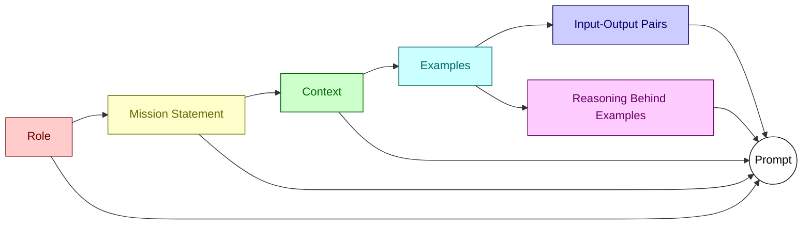

# :wave: Welcome to the Workshop Track Guide! :1st_place_medal:

## Pre-Reqs: Advanced Track :books:

> [!NOTE]  
> This advanced track assumes you have working knowledge.
>
> - [GitHub Actions](https://docs.github.com/en/actions/using-workflows/workflow-syntax-for-github-actions)
> - [GitHub Markdown](https://github.github.com/gfm)

---
> [!WARNING]
> Make sure to follow the steps carefully. If you get stuck, refer to the resources provided before attempting the next step.
>

# :2nd_place_medal: Just wanna be Productive :beginner:

## :one: Goal: :dart:
   - Learn how to use gh-commit to send your commits at super speed.

## :two: Steps: :footprints:

   - :arrow_right: https://github.com/ghcli/gh-commit and follow the instructions.


---
# :1st_place_medal: DiY Advanced Track :rocket:

# :clipboard: Issue Templates :beginner:

## :one: Goal: :dart:
   Standardize issue creation with reusable templates

## :two: Resources: :books:
   - [Creating issue templates](https://docs.github.com/en/communities/using-templates-to-encourage-useful-issues-and-pull-requests/configuring-issue-templates-for-your-repository)
   - [Markdown Syntax](https://docs.github.com/en/get-started/writing-on-github/getting-started-with-writing-and-formatting-on-github/basic-writing-and-formatting-syntax)

## :three: Steps: :footprints:

- Under your repository name, click :gear: Settings.  
- :gear: Settings >> General >> Features
- In the "Features" section, under Issues, click Set up templates. You may need to enable Issues and refresh the page before you can see the button.<br>
  

- Use the Add template dropdown menu, and click on the type of template you'd like to create.<br>
  

- To preview or edit the template before committing it to the repository, next to the template, click Preview and edit.<br>


- To edit the template, click :pencil: Pencil Icon, and type in the fields to edit their contents.<br>


>>> OR
- In your repo, create a `.github/ISSUE_TEMPLATE` folder
- Add templates eg: bug-report.yml and feature-request.yml files with templates
- Now When creating new issues, you'll see options for templates

## :four: Customizations: :wrench:
   - Add multiple templates for different issue types
   - Use [markdown formatting](https://docs.github.com/en/get-started/writing-on-github/getting-started-with-writing-and-formatting-on-github/basic-writing-and-formatting-syntax) for rich text templates & [emojis](https://api.github.com/emojis)
   - Include automated labels, assignees, and text :label:

> [!IMPORTANT] 
> [Validate YAML syntax :exclamation:](https://www.yamllint.com)

#### Issue templates for inspiration:


<br>

---
# :construction_worker: Matrix Builds :gear:

## :one: Goal: :dart:
   Parallize workflow across multiple environments / variables / configurations

## :two: Resources: :books:
   - [GitHub matrix strategy](https://docs.github.com/en/actions/using-jobs/using-a-matrix-for-your-jobs)
   - https://docs.github.com/en/actions/using-workflows/workflow-syntax-for-github-actions#jobsjob_idstrategymatrix

## :three: Steps: :footprints:
   - In your workflow, add a matrix with os and node versions
   - Use matrix variables in runs-on and setup steps
   - Check the matrix on GitHub for job combinations

## :four: Customizations: :wrench:
   - Add more configurations like Python version, browsers, etc
   - Exclude specific job combinations
   - Parallelize jobs depending on runtime

### :information_source: example: :cool:

```yaml
name: Matrix Build

on: [push, pull_request]

jobs:
  build:
    runs-on: ubuntu-latest
    strategy:
      matrix:
        node-version: [12.x, 14.x, 16.x]

    steps:
      - uses: actions/checkout@v2
      - name: Use Node.js ${{ matrix.node-version }}
        uses: actions/setup-node@v2
        with:
          node-version: ${{ matrix.node-version }}
      - run: npm ci
      - run: npm test
```

<details>
<summary>Hint</summary>
:bulb: Have fun experimenting it to use different models or prompts etc
</details>

<br>

---
# :zap: Triggering Workflows :twisted_rightwards_arrows:

## :one: Goal: :dart:
   - Automate workflows based on issue events

   ```mermaid
   graph TD
classDef melon fill:#ffadadff,stroke:#ff6347ff,stroke-width:2px,color:#001a33ff 
classDef sunset fill:#ffd6a5ff,stroke:#ffa500ff,stroke-width:2px,color:#001a33ff
classDef jordy-blue fill:#a0c4ffff,stroke:#00bfffff,stroke-width:2px,color:#001a33ff
classDef tea-green fill:#caffbfff,stroke:#2e8b57ff,stroke-width:2px,color:#001a33ff
classDef pink fill:#ffc0cb,stroke:#ff69b4,stroke-width:2px,color:#001a33ff

A[Event occurs] --> B[Workflow triggered]
B --> C[Actions run]

subgraph Events
  E1[Issue Creation]
  E2[Pull request]
  A
  E3[Schedule]
end

subgraph SuperChargedActions
  L2[LLM Security Scan]
  L1[LLM Review]
  L3[Post Feedback]
end

C --> CA[Checkout code]
CA --> SuperChargedActions
L1 --> CB[Build code]
CB --> CC[Test code]
CC --> CD[Deploy code]
CD --> CE[Notification]

class A,B,C sunset
class E1,E2,E3 sunset
class A1,A2,A3,A4,A5 jordy-blue
class CA,CB,CC,CD,CE tea-green
class L1,L2,L3 pink
   ```

## :two: Resources: :open_book:
   - [Events that trigger workflows](https://docs.github.com/en/actions/using-workflows/events-that-trigger-workflows)

## :three: Steps: :footprints:
   - Listen for issues event in your workflow
   - On issue creation, add labels, assignee, kick off build
   - Create an issue and verify workflow triggers

## :four: Customizations: :wrench:
   - Trigger on additional events like pull requests, comments, etc
   - Chain multiple workflows together
   - [Add Conditional logic based on issue details](https://docs.github.com/en/actions/using-workflows/workflow-syntax-for-github-actions#jobsjob_idstepsif)

Trigger on additional events like pull requests, comments, etc
Another example would be to review a PR using LLM. In this case, we would want to trigger the workflow on pull_request events. The workflow would then need to get the contents of the pull request and feed it to the askgpt action.
Complete the missing steps in the below example worflow to review a PR using LLM.:

### :information_source: example: :cool:

```yaml
name: PR Review

on:
  pull_request:
    types: [opened, synchronize, reopened]

jobs:
  review:
    runs-on: ubuntu-latest
    steps:
      - name: Checkout code
        uses: actions/checkout@v2

      #add steps here to prepare the prompt and get the contents of the pull request and then feed it to the askgpt action.

      - name: Review PR with GPT
        uses: builtwithai/askgpt@v1.0.0
```

> [!IMPORTANT]
> Refer to Resources for more information on [events that trigger workflows](https://docs.github.com/en/actions/using-workflows/events-that-trigger-workflows)

<br>

---
# :loudspeaker: Prompt Anatomy: :new:



<br>
"Director shows what kind of expression she is looking on the scene"


---
# Want more, follow for Free talks & workshops <a href="https://medium.sankhe.com" target="blank"></a> and  <a href="https://www.linkedin.com/in/ski-s" target="blank"></a> and future updates :point_right: [here](https://medium.sankhe.com)


## [Would you trust an AI](https://github.com/orgs/wadwc/discussions/2)

## [Whats your use case?](https://github.com/orgs/wadwc/discussions/4)

## [Feedback](https://github.com/orgs/wadwc/discussions/3)


